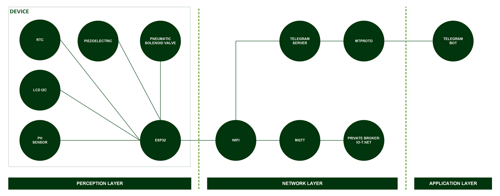
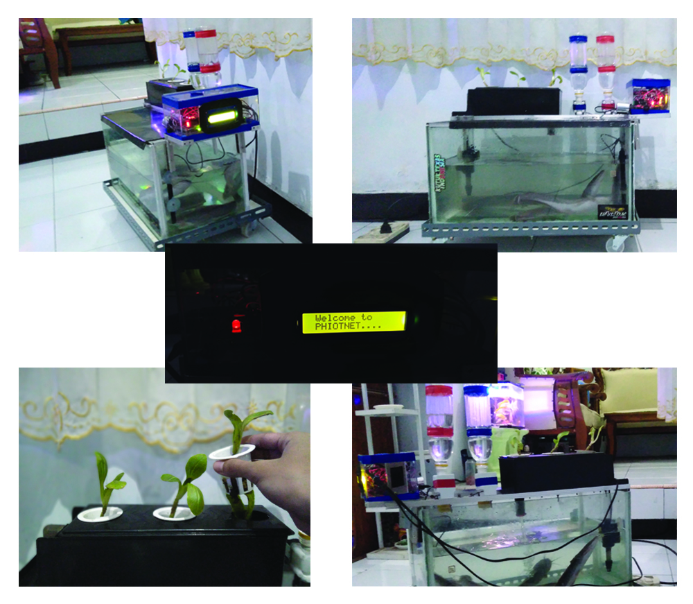

[](https://github.com/ellerbrock/open-source-badges/)
[](https://opensource.org/licenses/MIT)


# Aquaponic-pH-Control-Monitoring-with-Type-2-Fuzzy-Method-Based-on-IoT-Bot
<strong>Dokumentasi Skripsi - Informatika UPN Veteran Jatim</strong><br><br>
Sistem akuaponik adalah sistem pertanian gabungan antara ikan dengan sayuran yang saling menguntungkan. Di sisi lain, gagal panen juga dapat menjadi kekhawatiran bagi para petani akuaponik karena hal ini dapat terjadi kapan saja. Kegagalan panen dapat dipengaruhi oleh banyak faktor, namun biasanya disebabkan oleh ketidakjelasan pH air yang tinggi di sekitar ruang lingkup budidaya. Para petani akuaponik khawatir jika gagal panen terus berlanjut akan membahayakan ketahanan pangan mereka. Proyek ini dibuat dengan harapan dapat mengatasi masalah pH tersebut. Proyek ini telah dilaksanakan dan memakan waktu kurang lebih 1 tahun. Sistem yang dibuat dapat mengontrol dan memonitoring perubahan pH air setiap saat. Sistem ini berbasis Internet of Things (IoT), dengan menggunakan MQTT sebagai protokol komunikasinya. Sistem ini juga dilengkapi dengan kecerdasan buatan, yang menggunakan IT2FL (Interval Type-2 Fuzzy Logic) sebagai pendukung keputusannya. Selain itu, antarmuka sistem menggunakan Bot Telegram, sehingga memudahkan pengguna untuk berinteraksi.

<br><br>

## Kebutuhan Proyek
| Bagian | Deskripsi |
| --- | --- |
| Papan Pengembangan | DOIT ESP32 DEVKIT V1 |
| Papan Pendukung | Arduino Uno R3 |
| Editor Kode | Arduino IDE |
| Dukungan Aplikasi | • Bot Telegram<br>• Matlab R2020 |
| Driver | CP210X USB Driver |
| Platform IoT | io-t.net |
| Protokol Komunikasi | • Inter Integrated Circuit (I2C)<br>• Message Queuing Telemetry Transport (MQTT)<br>• MTProto |
| Arsitektur IoT | 3 Lapisan |
| Matlab |  Fuzzy Interface System |
| Bahasa Pemrograman | C/C++ |
| Pustaka Arduino | • WiFi (bawaan)<br>• PubSubClient<br>• LiquidCrystal_I2C<br>• CTBot<br>• ArduinoJson<br>• RTClib |
| Aktuator | • Submersible pump aquarium (x1)<br>• Pneumatic solenoid valve (x2)<br>• Piezoelectric (x1) |
| Sensor | • pH Sensor (x1)<br>• RTC (x1) |
| Layar | LCD I2C (x1) |
| Objek Percobaan | • Benih sawi pakcoy<br>• Benih lele dumbo |
| Komponen Lainnya | • Kabel USB Mikro - USB tipe A (x1)<br>• Kabel jumper (1 set)<br>• Switching power supply 12V 1A (x1)<br>• Relay elektromekanis 2-channel (x1)<br>• Saklar bulat (x1)<br>• Papan ekspansi ESP32 (x1)<br>• PCB Dot Matrix (x1)<br>• Terminal PCB block screw (x10)<br>• Socket female jack DC (x1)<br>• Connector male jack DC (x3)<br>• Probe Elektroda pH (x1)<br>• Pipa (1 set)<br>• Netpot (1 set)<br>• Rockwool (1 set)<br>• Kain flanel (1 set)<br>• Saringan air (x1)<br>• Dop kaca (1 set)<br>• Botol (x2)<br>• Tatakan beroda akuarium (x1)<br>• Akuarium (x1)<br>• Kotak akrilik (x1)<br>• Skun (1 set)<br>• Plat galvanis (x1)<br>• Baut plus (1 set)<br>• Mur (1 set) |

<br><br>

## Unduh & Instal
1. Arduino IDE

   <table><tr><td width="810">
      
   ```
   https://www.arduino.cc/en/software
   ```

   </td></tr></table><br>

2. CP210X USB Driver

   <table><tr><td width="810">

   ```
   https://bit.ly/CP210X_USBdriver
   ```

   </td></tr></table><br>

3. Matlab R2020

   <table><tr><td width="810">

   ```
   https://bit.ly/MATLAB_R2020a_Installer
   ```

   </td></tr></table>

<br><br>

## Rancangan Proyek
<table>
<tr>
<th width="840">Infrastruktur</th>
</tr>
<tr>
<td></td>
</tr>
</table>
<table>
<tr>
<th width="280">Diagram Ilustrasi</th>
<th width="280">Desain Prototipe</th>
<th width="280">Desain Wadah Utama</th>
</tr>
<tr>
<td></td>
<td></td>
<td></td>
</tr>
</table>
<table>
<tr>
<th width="280">Sistem Antarmuka Fuzzy IT2FL</th>
<th width="280">Variabel Masukan IT2FL</th>
<th width="280">Variabel Keluaran IT2FL</th>
</tr>
<tr>
<td></td>
<td></td>
<td></td>
</tr>
</table>

<br><br>

## Memindai Alamat I2C Yang Ada Pada LCD
<table><tr><td width="840">
   
```ino
#include <Wire.h>

void setup() {
  Wire.begin();
  Serial.begin(115200);
  while (!Serial); // Tunggu monitor serial
  Serial.println("\nI2C Scanner");
}

void loop() {
  int nDevices = 0;
  Serial.println("Scanning...");

  for (byte address = 1; address < 127; ++address) {
    // i2c_scanner menggunakan nilai balik dari Wire.endTransmission
    // Untuk melihat apakah sebuah perangkat memang mengakui alamat tersebut
    Wire.beginTransmission(address);
    byte error = Wire.endTransmission();

    if (error == 0) {
      Serial.print("I2C device found at address 0x");
      if (address < 16) {
        Serial.print("0");
      }
      Serial.print(address, HEX);
      Serial.println("  !");

      ++nDevices;
    } else if (error == 4) {
      Serial.print("Unknown error at address 0x");
      if (address < 16) {
        Serial.print("0");
      }
      Serial.println(address, HEX);
    }
  }
  if (nDevices == 0) {
    Serial.println("No I2C devices found\n");
  } else {
    Serial.println("done\n");
  }
  delay(5000); // Tunggu 5 detik untuk pemindaian berikutnya
}
```

</td></tr></table><br><br>

## Kalibrasi Sensor pH
Sensor pH dapat di kalibrasi dengan menggunakan hasil perhitungan regresi linear. Persamaan regresi linear dapat anda lihat sebagai berikut.

<table>
   <tr>
   <td width="40">I</td>
   <td width="800" height="80">

   $\ Y = a+b.X $
         
   </td>
   </tr>
</table><br>

Penjelasan dari simbol-simbol yang ada di persamaan I, dapat anda lihat selengkapnya pada tabel berikut.

<table>
   <tr height="50px">
      <th width="120">Simbol</th>
      <th width="720">Keterangan</th>
   </tr>
   <tr>
      <td>𝑌</td>
      <td>nilai buffer pH</td>
   </tr>
   <tr>
      <td>𝑋</td>
      <td>nilai tegangan yang diperoleh berdasarkan Y</td>
   </tr>
   <tr>
      <td>𝑎 dan 𝑏</td>
      <td>nilai ketetapan regresi linear</td>
   </tr>
</table><br>

Nilai ketetapan regresi linear (a dan b) dapat diperoleh melalui persamaan II dan III.

<table>
   <tr>
   <td width="40">II</td>
   <td width="800" height="80">
   
   $\ a = \frac{\sum Y.\sum X^{2}-\sum X.\sum XY}{n.\sum X^{2}-(\sum X)^{2}} $

   </td>
   </tr>
   <tr>
   <td width="40">III</td>
   <td width="800" height="80">
   
   $\ b = \frac{n.\sum XY-\sum X.\sum Y}{n.\sum X^{2}-(\sum X)^{2}} $

   </td>
   </tr>
</table><br>

Contoh kalibrasi sensor pH: <a href="https://github.com/devancakra/Aquaponic-pH-Control-Monitoring-with-Type-2-Fuzzy-Method-Based-on-IoT-Bot/blob/master/Assets/Articles/Contoh-Kalibrasi-SensorpH.md">Klik Disini</a>

<br><br>

## Kalibrasi Sensor RTC
Sensor RTC ini dapat di kalibrasi dengan menggunakan kode program berikut :

<table><tr><td width="840">

```ino
#include <RTClib.h> // Memanggil pustaka RTC
RTC_DS3231 rtc; // Konstruktor

void setup() {
   RTCinit(); // Memanggil metode RTCinit
}

void loop() {}

void RTCinit() {
   // Memulai RTC
   rtc.begin();

   // Pengaturan Tanggal dan Waktu
   rtc.adjust(DateTime(F(__DATE__), F(__TIME__)));

   // Atur Waktu Sekarang
   // Jika sudah di kalibrasi, silakan tutup dengan komentar
   rtc.adjust(DateTime(YYYY,MM,DD,HH,MM,SS));
}
```

</td></tr></table><br><br>

## Pengaturan Arduino IDE
1. Buka ``` Arduino IDE ``` terlebih dahulu, kemudian buka proyek dengan cara klik ``` File ``` -> ``` Open ``` :

   <table><tr><td width="810">
      
      ``` PH_IT2FL.ino ```

   </td></tr></table><br>
   
2. Isi ``` Url Pengelola Papan Tambahan ``` di Arduino IDE

   <table><tr><td width="810">
      
      Klik ``` File ``` -> ``` Preferences ``` -> masukkan ``` Boards Manager Url ``` dengan menyalin tautan berikut :
      
      ```
      https://dl.espressif.com/dl/package_esp32_index.json
      ```

   </td></tr></table><br>
   
3. ``` Pengaturan Board ``` di Arduino IDE

   <table>
      <tr><th width="810">

      Cara mengatur board ``` DOIT ESP32 DEVKIT V1 ```
            
      </th></tr>
      <tr><td>
      
      • Klik ``` Tools ``` -> ``` Board ``` -> ``` Boards Manager ``` -> Instal ``` esp32 ```.
   
      • Kemudian klik ``` Tools ``` -> ``` Board ``` -> ``` ESP32 Arduino ``` -> ``` DOIT ESP32 DEVKIT V1 ```.
   
      • Board ``` Arduino Uno ``` yang ada di proyek ini hanya digunakan sebagai filter atau pembagi tegangan.
   
      • Anda tidak perlu melakukan konfigurasi pada board ``` Arduino Uno ```, cukup hanya berfokus pada ``` ESP32 ``` saja.

      </td></tr>
   </table><br>
   
4. ``` Ubah Kecepatan Papan ``` di Arduino IDE

   <table><tr><td width="810">
      
      Klik ``` Tools ``` -> ``` Upload Speed ``` -> ``` 9600 ```

   </td></tr></table><br>
   
5. ``` Instal Pustaka ``` di Arduino IDE

   <table><tr><td width="810">
      
      Unduh semua file zip pustaka. Kemudian tempelkan di: ``` C:\Users\Computer_Username\Documents\Arduino\libraries ```

   </td></tr></table><br>

6. ``` Pengaturan Port ``` di Arduino IDE

   <table><tr><td width="810">
      
      Klik ``` Port ``` -> Pilih sesuai dengan port perangkat anda ``` (anda dapat melihatnya di Device Manager) ```

   </td></tr></table><br>

7. Ubah ``` Nama WiFi ```, ``` Kata Sandi WiFi ```, dan sebagainya sesuai dengan apa yang anda gunakan saat ini.<br><br>

8. Sebelum mengunggah program, silakan klik: ``` Verify ```.<br><br>

9. Jika tidak ada kesalahan dalam kode program, silakan klik: ``` Upload ```.<br><br>
    
10. Beberapa hal yang perlu anda lakukan saat menggunakan ``` board ESP32 ``` :

    <table><tr><td width="810">
       
       • Informasi ``` Arduino IDE ```: ``` Uploading... ``` -> segera tekan dan tahan tombol ``` BOOT ```.

       • Informasi ``` Arduino IDE ```: ``` Writing at .... (%) ``` -> lepaskan tombol ``` BOOT ```.

       • Tunggu sampai muncul pesan: ``` Done Uploading ``` -> ``` Program langsung dioperasikan ```.

       • Tekan tombol ``` EN (RST) ``` lalu ``` Restart ``` untuk menangani board ``` ESP32 ``` yang tidak bisa memproses ``` SC ```.

       • Jangan tekan tombol ``` BOOT ``` dan ``` EN ``` secara bersamaan karena hal ini bisa beralih ke mode ``` Unggah Firmware ```.

    </td></tr></table><br>

11. Jika masih ada masalah saat unggah program, maka coba periksa pada bagian ``` driver ``` / ``` port ``` / ``` yang lainnya ```.

<br><br>

## Pengaturan io-t.net
1. Memulai io-t.net :

   <table><tr><td width="810">
      
      • Buka situs resminya di tautan berikut : <a href="https://io-t.net/">io-t.net</a>.
      
      • Jika anda belum memiliki akun, silakan <a href="https://i-ot.net/register">Daftar</a> terlebih dahulu -> aktivasi akun melalui email.
      
      • Jika anda sudah memiliki akun, silakan <a href="https://i-ot.net/login">Masuk</a> untuk dapat mengakses layanan io-t.net.

   </td></tr></table><br>

3. Buat node :

   <table><tr><td width="810">
      
      • Masuk ke menu ``` Instance ``` -> ``` Atur Node ```.
      
      • Lalu berikan nama yang unik pada node yang anda gunakan.

   </td></tr></table><br>

4. Buat device :

   <table><tr><td width="810">
      
      • Masuk ke menu ``` Devices ```.
   
      • Pilih ``` Tambah Devices ``` -> isi bagian ``` Client ID ```, ``` Access ```, ``` Topic ``` sesuai dengan kebutuhan. Contohnya :
      
      - ``` Client ID ``` -> ``` Phiotnet_v1 ```.
        
      - ``` Access ``` -> ``` Publish & Subscribe ```.
        
      - ``` Topic ``` -> ``` detect ```.

   </td></tr></table>
   
<br><br>

## Pengaturan Bot Telegram
1. Buka <a href="https://t.me/botfather">@BotFather</a>.<br><br>

2. Ketik ``` /newbot ```.<br><br>

3. Ketik nama bot yang diinginkan, contoh: ``` phiotnet_bot ```.<br><br>

4. Ketik nama pengguna bot yang diinginkan, contoh: ``` phiotnet_bot ```.<br><br>

5. Lakukan juga untuk pengaturan gambar bot, deskripsi bot, dan lain sebagainya menyesuaikan dengan kebutuhan anda.<br><br>

6. Salin ``` API token bot telegram anda ``` -> lalu tempelkan pada bagian ``` #define BOTtoken "YOUR_API_BOT_TOKEN" ```. 

   <table><tr><td width="810">
   Contohnya yaitu :<br><br>

   ```ino
   #define BOTtoken "2006772150:AAE6Fdjk3KbiySkzV6CLbd6ClJDzgTfJ5y0"
   ```

   </td></tr></table>

<br><br>

## Pengaturan Matlab
1. Buka ``` Matlab ```.<br><br>

2. Buka kotak dialog ``` Set Path ``` menggunakan perintah :
   
   <table><tr><td width="810">
      
   ```
   pathtool
   ```

   </td></tr></table>
   
   <br><br>

3. Pilih ``` Add Folder... ``` -> cari folder ``` FIS-IT2FLS-Toolbox-MATLAB ``` -> ``` Select Folder ```.<br><br>

4. Klik ``` Save ``` dan kemudian klik ``` Close ```.<br><br>

5. Buka ``` IT2FL Toolbox ``` menggunakan perintah :
   
   <table><tr><td width="810">

   ```
   fuzzyt2
   ```

   </td></tr></table>
   
   <br><br>

6. Selebihnya tinggal anda atur sesuai dengan kebutuhan anda.

<br><br>
   
## Memulai
1. Unduh dan ekstrak repositori ini.<br><br>
   
2. Pastikan anda memiliki komponen elektronik yang diperlukan.<br><br>
   
3. Pastikan komponen anda telah dirancang sesuai dengan diagram.<br><br>
   
4. Konfigurasikan perangkat anda menurut pengaturan di atas.<br><br>

5. Selamat menikmati [Selesai].

<br><br>

## Demonstrasi Aplikasi
Via Telegram: <a href="https://t.me/phiotnet_bot">@phiotnet_bot</a>

<br><br>

## Sorotan
<table>
<tr>
<th width="280">Produk</th>
<th width="280">Sistem Pendukung Keputusan (SPK) IT2FL</th>
<th width="280">Bot Telegram</th>
</tr>
<tr>
<td></td>
<td></td>
<td></td>
</tr>
</table>

<br>
<b>Informasi lebih lanjut:</b> <br><br>
<table><tr><td width="840">
      
   • Skripsi: <a href="http://repository.upnjatim.ac.id/id/eprint/7014"><u>Klik Disini</u></a><br><br>
   • Jurnal tipe SINTA: <a href="https://publikasi.mercubuana.ac.id/index.php/Incomtech/article/view/15453"><u>Klik Disini</u></a><br><br>
   • Jurnal tipe Non SINTA: <a href="https://www.researchgate.net/publication/363660330_SISTEM_KONTROL_PH_UP-DOWN_BERBASIS_NODEMCU32_DENGAN_METODE_ON-OFF_CONTROLLER"><u>Klik Disini</u></a>
</td></tr></table>

<br><br>

##  Catatan
<ul>
<li>
   <strong><p>Saran Perbaikan Hardware :</p></strong>
   <table>
   <tr>
   <td width="20">1.</td>
   <td width="820">Ubah pengaturan Relay Elektromekanis 2-Channel dari NO (Normally Open) menjadi NC (Normally Close) untuk mengurangi panas berlebih.</td>
   </tr>
   <tr>
   <td width="20">2.</td>
   <td width="820">Gunakan PSU standar dengan kapasitas 3A untuk menyuplai seluruh perangkat yang terpasang.</td>
   </tr>
   <tr>
   <td width="20">3.</td>
   <td width="820">Tambahkan Step Down Converter untuk mendapatkan tegangan yang lebih stabil dan sesuai dengan kebutuhan perangkat. Dengan adanya komponen ini, maka tidak membutuhkan Arduino Uno.</td>
   </tr>
   <tr>
   <td width="20">4.</td>
   <td width="820">Tambahkan isolator pada komponen listrik untuk mencegah arus bocor.</td>
   </tr>
   <tr>
   <td width="20">5.</td>
   <td width="820">Tambahkan kipas atau ventilasi untuk meningkatkan aliran udara dan mencegah panas berlebih.</td>
   </tr>
   <tr>
   <td width="20">6.</td>
   <td width="820">Tambahkan Heat Sink pada komponen yang rentan panas.</td>
   </tr>
   <tr>
   <td width="20">7.</td>
   <td width="820">Tambahkan MCB (Miniature Circuit Breaker) untuk mencegah arus berlebih, sehingga perangkat tetap aman dan terlindungi.</td>
   </tr>
   <tr>
   <td width="20">8.</td>
   <td width="820">Tambahkan casing khusus untuk melindungi Probe Sensor pH dari kerusakan, terutama akibat benturan.</td>
   </tr>
   <tr>
   <td width="20">9.</td>
   <td width="820">Pertimbangkan untuk memilih lebih dari 1 Development Board untuk meningkatkan optimalisasi sistem.</td>
   </tr>
   <tr>
   <td width="20">10.</td>
   <td width="820">Pertimbangkan untuk mengganti Relay Elektromekanis 2-Channel dengan Relay SSR DD untuk memperoleh kendali yang lebih halus (tanpa noise), respon lebih cepat, konsumsi daya lebih rendah, efisiensi lebih tinggi, serta daya tahan lebih baik untuk penggunaan jangka panjang.</td>
   </tr>
   <tr>
   <td width="20">11.</td>
   <td width="820">Pertimbangkan untuk mengganti kotak akrilik dengan box panel standar agar perangkat yang ada jauh lebih aman dan rapi.</td>
   </tr>
   <tr>
   <td width="20">12.</td>
   <td width="820">Pertimbangkan untuk mengganti kabel sesuai dengan standar penggunaan. Untuk listrik DC, gunakan kabel AVS 1 x 0,5mm², yang lebih tahan lama dibandingkan kabel pita. Sementara itu, untuk listrik AC, gunakan kabel NYY-HY 2 x 1,5mm², karena lebih tahan terhadap air, cuaca, serta gangguan fisik seperti gigitan tikus.</td>
   </tr>
   </table>
</li><br>
<li>
   <strong><p>Saran Perbaikan Firmware :</p></strong>
   <table>
   <tr>
   <td width="20">1.</td>
   <td width="820">Optimalkan algoritma untuk mengurangi latensi pada proses pengambilan keputusan. Disarankan menggunakan RTOS (Real-Time Operating System) agar dapat mengatur lebih baik prioritas fungsi yang ada.</td>
   </tr>
   <tr>
   <td width="20">2.</td>
   <td width="820">Tambahkan metode OTA (Over The Air) untuk meningkatkan keamanan jaringan, termasuk Bot Telegram.</td>
   </tr>
   <tr>
   <td width="20">3.</td>
   <td width="820">Tambahkan EEPROM untuk menyimpan hasil kalibrasi sensor pH secara permanen, sehingga kalibrasi tidak perlu dituliskan di method loop() lagi. Hal ini dapat menghemat waktu dan meningkatkan efisiensi perangkat.</td>
   </tr>
   <tr>
   <td width="20">4.</td>
   <td width="820">Tambahkan pustaka ArduLite dan gunakan sintaksnya untuk meringankan beban ESP32, karena dapat mengurangi penggunaan memori ESP32. ArduLite ini sangat ideal untuk proyek-proyek dengan sumber daya terbatas yang mengutamakan efisiensi dan kesederhanaan. Link: https://github.com/ArduLite/ArduLite.</td>
   </tr>
   </table>
</li><br>
<li>
   <strong><p>Saran Peningkatan Fitur Otomatisasi :</p></strong>
   <table>
   <tr>
   <td width="20">1.</td>      
   <td width="820">Pompa otomatis yang diintegrasikan dengan sensor level untuk mengontrol pengisian cairan berupa pH dan AB Mix.</td>
   </tr>
   <tr>
   <td width="20">2.</td>      
   <td width="820">Pemberian pakan otomatis berbasis waktu untuk memberikan pakan secara terjadwal.</td>
   </tr>
   <tr>
   <td width="20">3.</td>      
   <td width="820">Pompa otomatis yang dikendalikan melalui bot telegram untuk mempermudah proses pengurasan dan pengisian air.</td>
   </tr>
   <tr>
   <td width="20">4.</td>      
   <td width="820">Pemantauan kualitas air pada kolam atau akuarium menggunakan perpaduan antara sensor pH, suhu air, dan amonia.</td>
   </tr>
   <tr>
   <td width="20">5.</td>      
   <td width="820">Penyinaran tanaman dengan lampu pertumbuhan untuk menumbuhkan tanaman secara optimal meski dalam kondisi yang minim cahaya (sebagai pengganti sinar matahari).</td>
   </tr>
   </table>
</li><br>
<li>
   <strong><p>Saran Optimalisasi Media Tanam :</p></strong>
   <table>
   <tr>
   <td width="20">1.</td>
   <td width="820">Tingkatkan jumlah modul hidroponik agar mampu menampung lebih banyak tanaman.</td>
   </tr>
   <tr>
   <td width="20">2.</td>
   <td width="820">Eksplorasi media tanam alternatif seperti arang sekam atau cocopeat untuk meningkatkan efisiensi pertumbuhan tanaman.</td>
   </tr>
   </table>
</li>
</ul>

<br><br>

## Apresiasi
Jika karya ini bermanfaat bagi anda, maka dukunglah karya ini sebagai bentuk apresiasi kepada penulis dengan mengklik tombol ``` ⭐Bintang ``` di bagian atas repositori.

<br><br>

## Penafian
Aplikasi ini merupakan hasil karya saya sendiri dan bukan merupakan hasil plagiat dari penelitian atau karya orang lain, kecuali yang berkaitan dengan layanan pihak ketiga yang meliputi: pustaka, kerangka kerja, dan lain sebagainya.

<br><br>

## LISENSI
LISENSI MIT - Hak Cipta © 2022 - Devan C. M. Wijaya, S.Kom

Dengan ini diberikan izin tanpa biaya kepada siapa pun yang mendapatkan salinan perangkat lunak ini dan file dokumentasi terkait perangkat lunak untuk menggunakannya tanpa batasan, termasuk namun tidak terbatas pada hak untuk menggunakan, menyalin, memodifikasi, menggabungkan, mempublikasikan, mendistribusikan, mensublisensikan, dan/atau menjual salinan Perangkat Lunak ini, dan mengizinkan orang yang menerima Perangkat Lunak ini untuk dilengkapi dengan persyaratan berikut:

Pemberitahuan hak cipta di atas dan pemberitahuan izin ini harus menyertai semua salinan atau bagian penting dari Perangkat Lunak.

DALAM HAL APAPUN, PENULIS ATAU PEMEGANG HAK CIPTA DI SINI TETAP MEMILIKI HAK KEPEMILIKAN PENUH. PERANGKAT LUNAK INI DISEDIAKAN SEBAGAIMANA ADANYA, TANPA JAMINAN APAPUN, BAIK TERSURAT MAUPUN TERSIRAT, OLEH KARENA ITU JIKA TERJADI KERUSAKAN, KEHILANGAN, ATAU LAINNYA YANG TIMBUL DARI PENGGUNAAN ATAU URUSAN LAIN DALAM PERANGKAT LUNAK INI, PENULIS ATAU PEMEGANG HAK CIPTA TIDAK BERTANGGUNG JAWAB, KARENA PENGGUNAAN PERANGKAT LUNAK INI TIDAK DIPAKSAKAN SAMA SEKALI, SEHINGGA RISIKO ADALAH MILIK ANDA SENDIRI.
